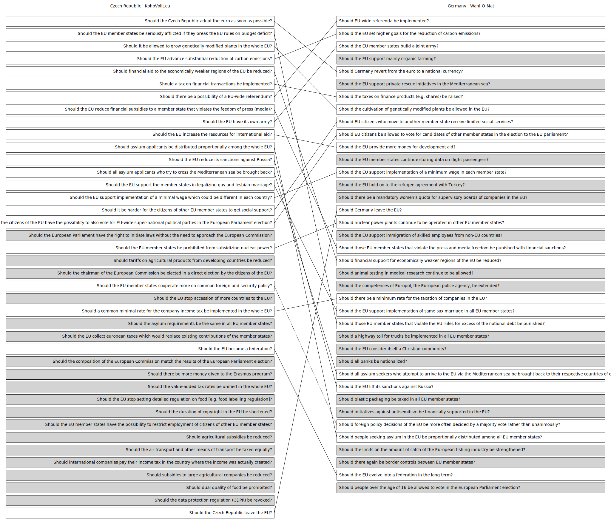

# Voting advice application comparison

A chart comparing the voting advice applications for the **2019 European
Parliament election** of:

&#x1f1e8;&#x1f1ff; Czech Republic ([Volební kalkulačka, Volby do Evropského
parlamentu 2019](https://eu2019.programydovoleb.cz/volebni-kalkulacka/) by
[Programy do voleb](https://www.programydovoleb.cz/))\
&#x1f1e9;&#x1f1ea; Germany ([Wahl-O-Mat zur Europawahl
2019](https://www.wahl-o-mat.de/europawahl2019/) by [Bundeszentrale für
politische Bildung](https://www.bpb.de/))

The **English translations and similarity classifications** (connections between the
questions) are **NOT OFFICIAL**.

Legend:

- **gray background** = unique question
- **solid line** connection between questions = very similar questions
- **dashed line** connection between questions = related questions



## Drawing the chart

### Installation

#### Mac

``` shell
$ brew install python graphviz
$ pip install pipenv
$ make setup
```

#### Arch Linux

``` shell
# pacman -S pipenv graphviz
$ make setup
```

#### Other systems

Install these dependencies manually:

- Python 3.7
- pipenv
- graphviz

Then run:

``` shell
$ make setup
```

### Usage

#### Rendering the chart as SVG

```
$ make
```

The chart SVG will be created at `dist/graph.svg`.

### Development

#### Installation

``` shell
make setup-dev
```

#### Linting

``` shell
make lint
```

#### Help

``` shell
make help
```

### Contributing

**Feel free to remix this project** under the terms of the [Apache License,
Version 2.0](http://www.apache.org/licenses/LICENSE-2.0).
